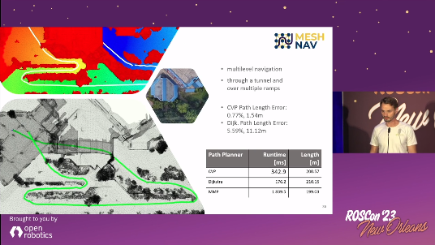

This is the active ROS2 branch of this repository.
If your are looking for the old ROS1 version, checkout the [noetic branch](https://github.com/naturerobots/mesh_navigation/tree/noetic).

# Mesh Navigation

The *Mesh Navigation* bundle provides software for efficient robot navigation on 2D manifolds, which are represented in 3D as triangle meshes. It enables safe navigation in various complex outdoor environments by using a modularly extensible
layered mesh map. Layers can be loaded as plugins representing specific geometric or semantic metrics of the terrain. This allows the incorporation of obstacles in these complex outdoor environments into path and motion motion planning.
The layered *Mesh Map* is integrated with *Move Base Flex (MBF)*, which provides a universal ROS action interface for path planning, motion control, and for recovery behaviors. We also provide additional planner and controller plugins that run on the layered mesh map.

Maintainers:
* [Matthias Holoch](mailto:matthias.holoch@naturerobots.com)
* [Sebastian Pütz](mailto:sebastian.puetz@naturerobots.com)
Author: [Sebastian Pütz](mailto:spuetz@uos.de)

* [Publications](#publications)
* [Installation](#installation)
* [Software Stack](#software-stack)
* [Usage](#usage)
* [Mesh Map](#mesh-map)
* [Planners](#planners)
* [Controllers](#controllers)
* [Simulation](#simulation)
* [Demos](#demos)
* [Build Status](#build-status)


## Publications
Please reference the following papers when using the navigation stack in your scientific work.

#### Continuous Shortest Path Vector Field Navigation on 3D Triangular Meshes for Mobile Robots
```  
@inproceedings{puetz21cvp,
    author = {Pütz, Sebastian and Wiemann, Thomas and Kleine Piening, Malte and Hertzberg, Joachim},
    title = {Continuous Shortest Path Vector Field Navigation on 3D Triangular Meshes for Mobile Robots},
    booktitle = {2021 IEEE International Conference on Robotics and Automation (ICRA)},
    year = 2021,
    url = {https://github.com/uos/mesh_navigation},
    note = {Software available at \url{https://github.com/uos/mesh_navigation}}
}
```
#### Move Base Flex: A Highly Flexible Navigation Framework for Mobile Robots
```  
@inproceedings{puetz18mbf,
    author = {Sebastian Pütz and Jorge Santos Simón and Joachim Hertzberg},
    title = {{Move Base Flex}: A Highly Flexible Navigation Framework for Mobile Robots},
    booktitle = {2018 IEEE/RSJ International Conference on Intelligent Robots and Systems (IROS)},
    year = 2018,
    month = {October},
    url = {https://github.com/magazino/move_base_flex},
    note = {Software available at \url{https://github.com/magazino/move_base_flex}}
}
```

## Installation

Please use the official released ros package or install more recent versions from source.  

`sudo apt install ros-melodic-mesh-navigation`

**Installation from source**  
All dependencies can be installed using rosdep  
`rosdep install mesh_navigation`

As explicit dependencies we refer to the following ROS packages, which are also developed by us:

* **[lvr2](https://github.com/uos/lvr2)**
* **[mesh_tools](https://github.com/uos/mesh_tools/)**
* **[move_base_flex](https://github.com/magazino/move_base_flex/)**

Use the **[pluto_robot](https://github.com/uos/pluto_robot)** package for example HDF5 map datasets, Gazebo simulations, and example configurations.

## Software Stack

This **[mesh_navigation](https://github.com/uos/mesh_navigation)** stack provides a navigation server for 
**[Move Base Flex (MBF)](https://github.com/magazino/move_base_flex)**. It provides a couple of configuration files and launch 
files to start the navigation server with the configured layer plugins for the layered mesh map, and the configured
planners and controller to perform path planning and motion control in 3D (or more specifically on 2D-manifold). 

The package structure is as follows:

- `mesh_navigation` The corresponding ROS meta package.

- `mbf_mesh_core` contains the plugin interfaces derived from the abstract MBF plugin interfaces to initialize 
  planner and controller plugins with one `mesh_map` instance. It provides the following three interfaces:
  
  - MeshPlanner - `mbf_mesh_core/mesh_planner.h`
  - MeshController - `mbf_mesh_core/mesh_controller.h`
  - MeshRecovery - `mbf_mesh_core/mesh_recovery.h`

- `mbf_mesh_nav` contains the mesh navigation server which is built on top of the abstract MBF navigation server.
  It uses the plugin interfaces in `mbf_mesh_core` to load and initialize plugins of the types described above.

- `mesh_map` contains an implementation of a mesh map representation building on top of the mesh data structures
  in **[lvr2](https://github.com/uos/lvr2)**. This package provides a layered mesh map implementation. Layers can be 
  loaded as plugins to allow a highly configurable 3D navigation stack for robots traversing on the ground in outdoor
  and rough terrain.

- `mesh_layers` The package provides a couple of mesh layers to compute the trafficability of the terrain. 
  Furthermore, these plugins have access to the HDF5 map file and can load and store layer information. 
  The mesh layers can be configured for the robots abilities and needs. Currently we provide the following layer plugins:
  
  - HeightDiffLayer - `mesh_layers/HeightDiffLayer`
  - RoughnessLayer - `mesh_layers/RoughnessLayer`
  - SteepnessLayer - `mesh_layers/SteepnessLayer`
  - RidgeLayer - `mesh_layer/RidgeLayer`
  - InflationLayer - `mesh_layers/InflationLayer`

- `dijkstra_mesh_planner` contains a mesh planner plugin providing a path planning method based on Dijkstra's algorithm.
  It plans by using the edges of the mesh map. The propagation start a the goal pose, thus a path from every accessed 
  vertex to the goal pose can be computed. This leads to a sub-optimal potential field, which highly depends on the mesh 
  structure.

- `cvp_mesh_planner` contains a Fast Marching Method (FMM) wave front path planner to take the 2D-manifold into account.
  This planner is able to plan over the surface, due to that it results in shorter paths than the `dijkstra_mesh_planner`,
  since it is not restricted to the edges or topology of the mesh. A comparison is shown below. Please refer to the paper
  `Continuous Shortest Path Vector Field Navigation on 3D Triangular Meshes for Mobile Robots` which is stated above.

- `mesh_client` Is an experimental package to additionally load navigation meshes from a server.

## Usage

See the **[pluto_robot](https://github.com/uos/pluto_robot)** bundle for example configurations of the mesh navigatoin stack and usage.

### Mesh map configuratoin

TODO

### Planner and Controller configurations

TODO

### Path Planning and Motion Control

Use the *MeshGoal* tool from the MeshTools bundle to select a goal pose on the shown mesh in *RViz*. This can be added to the top panel *RViz*. 

## Mesh Map

### Mesh Layers

The following table gives an overview of all currently implemented layer plugins available in the stack and the 
corresponding types to specify for usage in the mesh map configuration. An example mesh map configuration is shown
below.

#### Overview of all layers

| Layer               | Plugin Type Specifier         | Description of Cost Computation          | Example Image                                                                           |
| ------------------- | ----------------------------- | ---------------------------------------- | --------------------------------------------------------------------------------------- |
| **HeightDiffLayer** | `mesh_layers/HeightDiffLayer` | local radius based height differences    |  |
| **RoughnessLayer**  | `mesh_layers/RoughnessLayer`  | local radius based normal fluctuation    |       |
| **SteepnessLayer**  | `mesh_layers/SteepnessLayer`  | arccos of the normal's z coordinate      |       |
| **RidgeLayer**      | `mesh_layer/RidgeLayer`       | local radius based distance along normal |                    |
| **InflationLayer**  | `mesh_layers/InflationLayer`  | by distance to a lethal vertex           |       |

## Planners

### Usage with Move Base Flex

Currently the following planners are available:

#### Dijkstra Mesh Planner

```
  - name: 'dijkstra_mesh_planner'
    type: 'dijkstra_mesh_planner/DijkstraMeshPlanner'
```

#### Continuous Vector Field Planner

```
  - name: 'cvp_mesh_planner'
    type: 'cvp_mesh_planner/CVPMeshPlanner'
```

#### MMP Planner

```
  - name: 'mmp_planner'
    type: 'mmp_planner/MMPPlanner'
```

The planners are compared to each other.

| Vector Field Planner                                                                        | Dijkstra Mesh Planner                                                                              | ROS Global Planner on 2.5D DEM                                                     |
| ------------------------------------------------------------------------------------------- | -------------------------------------------------------------------------------------------------- | ---------------------------------------------------------------------------------- |
|  |  |  |

## Controllers

## Simulation

If you want to test the mesh navigation stack with Pluto please use the simulation setup and the corresponding launch
files below for the respective outdoor or rough terrain environment. The mesh tools have to be installed.
We developed the **[Mesh Tools](https://github.com/uos/mesh_tools)** as a package consisting of message definitions, RViz plugins and tools, as well as a
persistence layer to store such maps. These tools make the benefits of annotated triangle maps available in ROS and
allow to publish, edit and inspect such maps within the existing ROS software stack.

## Demos

In the following demo videos we used the developed VFP, i.e., the wavefront_propagatn_planner.
It will be renamed soon to vector_field_planner.

| Dataset and Description                  | Demo Video                                                                                                               |
| ---------------------------------------- | ------------------------------------------------------------------------------------------------------------------------ |
| Botanical Garden of Osnabrück University | [](http://www.youtube.com/watch?v=qAUWTiqdBM4) |
| Stone Quarry in the Forest Brockum       | [](https://youtu.be/DFmv3wnIxug)             |

### Stone Quarry in the Forest in Brockum

| Colored Point Cloud                                                                              | Height Diff Layer                                                                                      | RGB Vertex Colors                                                                                       |
| ------------------------------------------------------------------------------------------------ | ------------------------------------------------------------------------------------------------------ | ------------------------------------------------------------------------------------------------------- |
|  |  |  |

## Mesh Localization

For the necessary localization of the robot relative to the mesh, we recommend using RMCL: [https://github.com/uos/rmcl](https://github.com/uos/rmcl). We presented the combination of both software packages at [ROSCon 2023](https://vimeo.com/879000775):

<a href="https://vimeo.com/879000775" target="_blank" ></a>

## Build Status

| ROS Distro  | GitHub CI | Develop | Documentation | Source Deb | Binary Deb |
|-------------|-----------|---------|---------------|------------|------------|
| **Noetic**  | [](https://github.com/uos/mesh_navigation/actions?query=workflow%3A%22Noetic+CI%22) | [](http://build.ros.org/job/Ndev__mesh_navigation__ubuntu_focal_amd64) | [](http://build.ros.org/job/Ndoc__mesh_navigation__ubuntu_focal_amd64) | [](http://build.ros.org/job/Nsrc_uF__mesh_navigation__ubuntu_focal__source) | [](http://build.ros.org/job/Nbin_uF64__mesh_navigation__ubuntu_focal_amd64__binary) | 