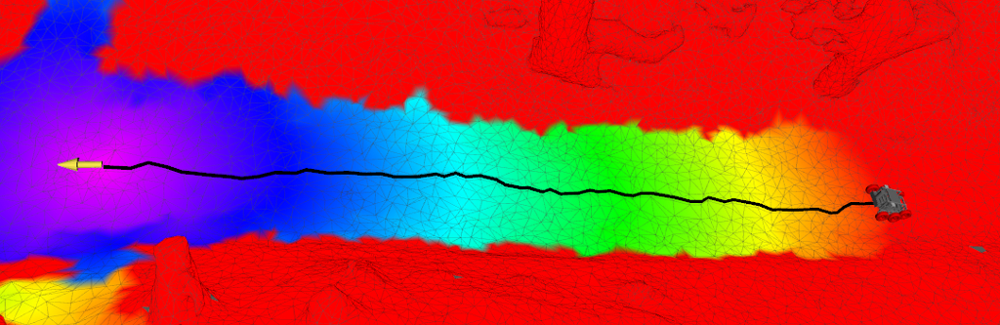
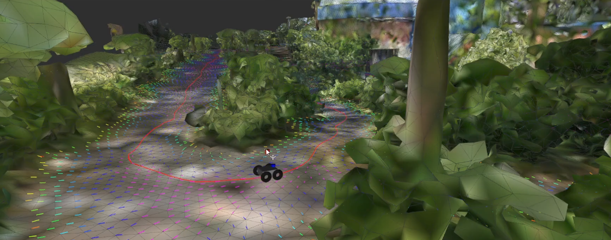

[](https://github.com/naturerobots/mesh_navigation/actions/workflows/jazzy.yaml)
[](https://github.com/naturerobots/mesh_navigation/actions/workflows/humble.yaml)

<div align="center" min-width=519px>
    
</div>
<h4 align="center">Mobile Robot Navigation in 3D Meshes</h4>
<div align="center">
  <a href="https://naturerobots.github.io/mesh_navigation_docs/tutorials/">Tutorials</a>
  <span>&nbsp;&nbsp;•&nbsp;&nbsp;</span>
  <a href="https://naturerobots.github.io/mesh_navigation_docs/">Documentation</a>
  <span>&nbsp;&nbsp;•&nbsp;&nbsp;</span>
  <a href="https://www.youtube.com/@nature-robots">Videos</a>
  <span>&nbsp;&nbsp;•&nbsp;&nbsp;</span>
  <a href="https://github.com/naturerobots/move_base_flex">Move Base Flex</a>
  <span>&nbsp;&nbsp;•&nbsp;&nbsp;</span>
  <a href="https://github.com/naturerobots/mesh_tools">Mesh Tools</a>

  <br />
</div>

---

The *Mesh Navigation* bundle (MeshNav) provides software for efficient robot navigation on 2D manifolds, which are represented in 3D as triangle meshes. It enables safe navigation in various complex outdoor environments by using a modularly extensible layered mesh map. Layers can be loaded as plugins representing specific geometric or semantic metrics of the terrain. This allows the incorporation of obstacles in these complex outdoor environments into path and motion planning.

<center><a href="https://www.youtube.com/watch?v=gvKsW5MEC4Y&list=PLZCjrqh-MUkTzEJxnscuDPakxjo-xKMTO&index=1"></a></center>


# Installation

### Installation from source

You need a working ROS 2 installation; we target `humble` and `jazzy` at the moment. Go into a ROS 2 workspace's source directory `cd $YOUR_ROS_WS/src`. Then clone the source code 

```bash
git clone git@github.com:naturerobots/mesh_navigation.git`
```

Get MeshNav's ROS 2 dependencies
* Clone source dependencies: Run `vcs import --input mesh_navigation/source_dependencies.yaml` in your ROS 2 workspace source directory.
* Get packaged dependencies: Run `rosdep install --from-paths . --ignore-src -r -y` from within your ROS 2 workspace source directory.

Build: Go to workspace root `cd $YOUR_ROS_WS` and run 

```bash
colcon build --packages-up-to mesh_navigation
```

# Getting Started

**Recommended entrypoint for new users:** Start with the **[mesh_navigation_tutorials](https://naturerobots.github.io/mesh_navigation_docs/tutorials/)**, a ready-to-use mesh navigation stack including simulated environments, RViz setup, and configuration files. As part of the tutorials, we also provide a collection of **virtual worlds** that work even without a robot or powerful hardware.

[>> Explore Virtual Worlds <<](https://naturerobots.github.io/mesh_navigation_docs/tutorials/tutorial_worlds/)

# MeshNav Plugins

MeshNav inherits the generic navigation interfaces from **[Move Base Flex (MBF)](https://github.com/naturerobots/move_base_flex)**, which provides a universal, map-agnostic ROS action interface for path planning, motion control, and recovery behaviors. This flexible architecture makes MeshNav extensible and interoperable with other navigation approaches. We also provide additional planner and controller plugins that run on the layered mesh map. MeshNav provides a plugin system so that you can write your own plugins for mesh layers and mesh-based planning & control. This project already provides several implementations you can use out of the box.

## Mesh Layers

Mesh layers are plugins that compute cost or feature values for each triangle or vertex in the mesh. They enable the robot to assess terrain properties and make informed navigation decisions. Each layer can represent different geometric or semantic characteristics of the environment.

|   |   |  |  |
|:---:|:---:|:---:|:---:|
|  HeightDiff | Roughness  |  Steepness |  Ridge |
|  |  |  |  |
|  Clearance | Inflation  |  Border |  Obstacle |
|  |   |  |  |

The layered approach allows combining multiple cost factors (e.g., steepness, roughness, obstacles) to create comprehensive traversability assessments for safe navigation in complex terrain.

[>> Explore Mesh Layers <<](https://naturerobots.github.io/mesh_navigation_docs/tutorials/mesh_cost_layers/)

## Planners & Controllers

MeshNav includes several planners and controllers specifically designed to work with mesh maps. These plugins leverage the 3D mesh structure to compute paths and control commands that respect the terrain geometry.

### Global Planners

| Dijkstra | Continuous Vector Field Planner (CVP) |
|:---:|:---:|
|  |  |
| `dijkstra_mesh_planner/DijkstraMeshPlanner`| `cvp_mesh_planner/CVPMeshPlanner` |

Both planners compute globally optimal paths across the mesh surface, taking into account the accumulated costs from all active mesh layers.

### Local Controllers

|  Vector Field Controller | MeshMPPI  |
|:---:|:---:|
|  |  |
| `mesh_controller/MeshController` | `mesh_mppi/DiffDriveMPC`/ `mesh_mppi/BicycleMPC` |

The controllers generate velocity commands to follow the planned path while reacting to local obstacles and terrain features.

[>> Explore Planners & Controllers <<](https://naturerobots.github.io/mesh_navigation_docs/tutorials/planner_and_controller/)

# Related Publications

Please reference the following papers when using the navigation stack in your scientific work.

#### 3D Navigation Mesh Generation for Path Planning in Uneven Terrain

```bib
@inproceedings{puetz20163dnav,
  title     = {3D Navigation Mesh Generation for Path Planning in Uneven Terrain},
  author    = {Pütz, Sebastian and Wiemann, Thomas and Sprickerhof, Jochen and Hertzberg, Joachim},
  booktitle = {9th IFAC Symposium on Intelligent Autonomous Vehicles (IAV)},
  series    = {IFAC-PapersOnLine},
  volume    = {49},
  number    = {15},
  pages     = {212--217},
  year      = {2016},
  doi       = {10.1016/j.ifacol.2016.07.734}
}
```

#### Continuous Shortest Path Vector Field Navigation on 3D Triangular Meshes for Mobile Robots
```bib
@inproceedings{puetz21cvp,
  title     = {Continuous Shortest Path Vector Field Navigation on 3D Triangular Meshes for Mobile Robots},
  author    = {Pütz, Sebastian and Wiemann, Thomas and Kleine Piening, Malte and Hertzberg, Joachim},
  booktitle = {2021 IEEE International Conference on Robotics and Automation (ICRA)},
  year      = {2021},
  doi       = {10.1109/ICRA48506.2021.9560981}
}
```

#### Navigation Control & Path Planning for Autonomous Mobile Robots

```bib
@phdthesis{puetz2022diss,
  title  = {Navigation Control \& Path Planning for Autonomous Mobile Robots}
  author = {Sebastian Pütz},
  school = {Universität Osnabrück},
  year   = {2022},
  doi    = {10.48693/69}
}
```

# Related Work

## Mesh Tools

We developed the **[Mesh Tools](https://github.com/naturerobots/mesh_tools)** as a package consisting of message definitions, RViz plugins and tools, as well as a
persistence layer to store such maps. These tools make the benefits of annotated triangle maps available in ROS and
allow to publish, edit and inspect such maps within the existing ROS software stack.

## Mesh Localization

For the necessary localization of the robot relative to the mesh, we recommend using [RMCL](https://github.com/uos/rmcl). We presented the combination of both software packages at [ROSCon 2023](https://vimeo.com/879000775):

<a href="https://vimeo.com/879000775" target="_blank" ></a>

# Maintain and Contribute

We are happy to receive improvements to the mesh navigation stack. Just open an issue. PRs are welcome!

Maintainers:
* [Matthias Holoch](mailto:matthias.holoch@naturerobots.com) (Nature Robots)
* [Alexander Mock](https://github.com/amock) (Nature Robots)
* [Justus Braun](https://github.com/justusbraun) (Osnabrück University)

Authors:
* [Sebastian Pütz](mailto:spuetz@uos.de) (Nature Robots)
* [Alexander Mock](https://github.com/amock) (Nature Robots)
* [Matthias Holoch](mailto:matthias.holoch@naturerobots.com) (Nature Robots)
* [Justus Braun](https://github.com/justusbraun) (Osnabrück University)

